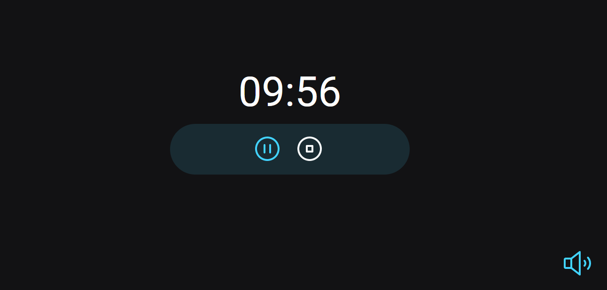

<h1 align="center"> DevLinks </h1>

Projeto desenvolvido durante o curso EXPLORER promovido pela Rocketseat para ensino de tecnologias WEB.  

  <a href="#-tecnologias">Tecnologias</a>

  

 

  

## 🚀 Tecnologias

Esse projeto foi desenvolvido com as seguintes tecnologias:

- HTML e CSS
- Git e Github
- Figma
- Java script

## 💻 Projeto

Um projeto feito para estudos de refaturamento e aplicação do Java script com module para um Cronometro de foco.

- [Acesse o projeto finalizado, online](https://zuuuussss.github.io/FocusTimer/)

Esse projeto está sob a licença MIT.

---

Feito com ♥ by Rocketseat :wave: [Participe da nossa comunidade!](https://discord.gg/rocketseat)
